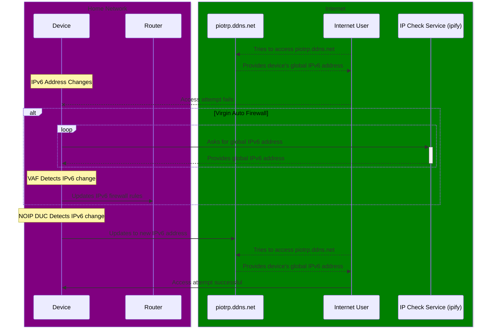

# Virgin Auto Firewall



I'm using the Virgin Media Hub 6 router (`F3896LG-VMIE`) which, *at least in my area*,
doesn't allow IPv4 port forwarding. It *does* however allow setting IPv6 firewall
rules, which means that you can still expose services on your home network to the internet.

This software keeps checking your device's global IPv6 address using [ipify](https://www.ipify.org/). When the IPv6 address inevitably changes, it updates the firewall rules on the router to allow incoming connections to the new address.

This is useful for residential internet users with dynamic IPv6 addresses
that want to host services on their home network. I use this in conjunction
with the [NO-IP DUC](https://www.noip.com/support/knowledgebase/automatic-ipv6-updates-linux-duc) to expose my Raspberry Pi 4B to the internet.

> [!WARNING]
> This software was specifically designed and only works with the Virgin
> Media Hub 6 router (`F3896LG-VMIE` by *Sagemcom*).

## Usage

I recommend the following:

```bash
sudo docker run -d \
-v /var/log:/tmp \
--net=host \
piotrpdev/virgin-auto-firewall:1.0.0-rspi \
-logPath=/tmp/vaf.log \
-routerPassword=abcde \
-debug=true \
-oldIP=aaaa:bbbb:cccc:dddd:aaaa:bbbb:cccc:dddd
```
